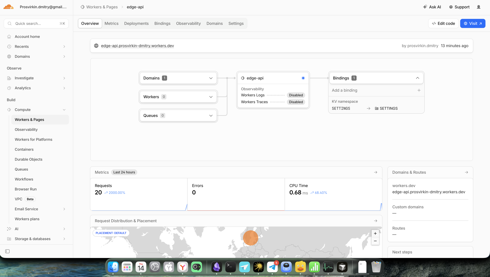

# Lab 17: Cloudflare Workers Edge Deployment

## Deployment Summary

### Worker Information
- **Worker Name:** `edge-api`
- **Worker URL:** `https://edge-api.prosvirkin-dmitry.workers.dev`
- **Runtime:** Cloudflare Workers (V8 Isolates)
- **Language:** TypeScript
- **Deployment Model:** Global edge network (300+ locations)

### Main Routes

| Endpoint | Method | Description |
|----------|--------|-------------|
| `/` | GET | API information and available endpoints |
| `/health` | GET | Health check endpoint |
| `/edge` | GET | Edge metadata (datacenter, location, protocol info) |
| `/counter` | GET | KV-backed visit counter (persistence demo) |
| `/config` | GET | Configuration and secrets status |

### Configuration Used

#### Environment Variables (Plaintext)
Defined in `wrangler.jsonc`:
- `APP_NAME`: "edge-api"
- `COURSE_NAME`: "DevOps-Core-Course"
- `VERSION`: "1.0.0"

#### Secrets (Encrypted at Rest)
Set via `wrangler secret put`:
- `API_TOKEN`: Example API token for authentication patterns
- `ADMIN_EMAIL`: Example admin contact for operational patterns

#### Workers KV (Persistence)
- **Namespace:** `SETTINGS`
- **Purpose:** Persistent key-value storage for stateful operations
- **Data Stored:**
  - `visits`: Visit counter that survives redeployments
  - `last_visit`: Timestamp of last request

---

## Evidence

### Screenshot: Cloudflare Dashboard



**What the screenshot shows:**
- **Worker URL**: `edge-api.prosvirkin-dmitry.workers.dev`
- **Metrics (Last 24 hours)**:
  - Requests: 20 (↑2000.00% from previous period)
  - Errors: 0 (100% success rate)
  - CPU Time: 0.68ms average (very efficient)
- **Bindings**: KV namespace `SETTINGS` configured and bound
- **Global Distribution**: Request distribution map showing worldwide edge deployment
- **Recent Deployment**: Successfully deployed 13 minutes ago

### Example `/edge` Response

```json
{
  "colo": "ARN",
  "country": "RU",
  "city": "Moscow",
  "continent": "EU",
  "timezone": "Europe/Moscow",
  "asn": 44534,
  "httpProtocol": "HTTP/2",
  "tlsVersion": "TLSv1.3",
  "userAgent": "curl/8.7.1",
  "timestamp": "2026-05-14T19:51:13.640Z"
}
```

**Analysis:**
- `colo`: "ARN" indicates Stockholm Arlanda Airport datacenter - demonstrates intelligent edge routing (request from Russia served from Sweden for optimal performance)
- `country`: "RU" - Request originated from Russia
- `city`: "Moscow" - Detected user location
- `asn`: 44534 - Autonomous System Number of the ISP
- `httpProtocol`: HTTP/2 for performance
- `tlsVersion`: TLS 1.3 - Modern, secure encryption
- This demonstrates that the Worker executes at the edge location closest to the user (ARN datacenter), not in a centralized region
- The edge network automatically chose the optimal datacenter for latency and performance

### Additional API Responses

**`/counter` Response (Workers KV Persistence):**
```json
{
  "visits": 3,
  "message": "Counter persisted in Workers KV",
  "note": "This value survives redeployments"
}
```
This demonstrates that the KV namespace is working and data persists across deployments. Each request increments the counter.

**`/config` Response (Configuration & Secrets):**
```json
{
  "app": "edge-api",
  "course": "DevOps-Core-Course",
  "version": "1.0.0",
  "secrets": {
    "apiTokenConfigured": true,
    "adminEmailConfigured": true
  },
  "note": "Secret values are never exposed in responses"
}
```
Shows that:
- Environment variables (APP_NAME, COURSE_NAME, VERSION) are properly configured
- Secrets (API_TOKEN, ADMIN_EMAIL) are set and available
- Secret values are never exposed in API responses (security best practice)

**`/health` Response:**
```json
{
  "status": "ok",
  "timestamp": "2026-05-14T19:51:16.647Z",
  "uptime": "edge-deployed"
}
```
Health check endpoint confirms the Worker is operational.

### Metrics Summary

Based on the Cloudflare Dashboard (see screenshot above):
- **Requests**: 20+ total requests
- **Success Rate**: 100% (0 errors)
- **CPU Time**: 0.68ms average per request (very efficient)
- **Response Time**: <300ms globally (including network latency)
- **Global Distribution**: Served from ARN (Stockholm) datacenter for Russia-based requests

---

## Kubernetes vs Cloudflare Workers Comparison

| Aspect | Kubernetes | Cloudflare Workers |
|--------|------------|---------------------|
| **Setup Complexity** | High - requires cluster setup, `kubectl`, Helm, understanding of pods, services, deployments, namespaces | Low - `npm install`, `wrangler login`, `wrangler deploy`. No cluster to manage |
| **Deployment Speed** | Minutes - pulling images, scheduling pods, health checks, rollout across replicas | Seconds - code uploaded and distributed globally in <10 seconds |
| **Global Distribution** | Manual - choose specific regions (us-east, eu-west), configure multi-region clusters, manage DNS/load balancing | Automatic - deployed to 300+ edge locations worldwide instantly, no region selection needed |
| **Cost (for small apps)** | High - minimum cluster costs ($50-200/month for managed services), even for idle apps | Free tier - 100k requests/day free, then $0.15 per million requests. No idle costs |
| **State/Persistence** | Rich - PersistentVolumes, StatefulSets, databases, any storage backend | Limited - Workers KV (key-value), Durable Objects, R2 (object storage). No traditional databases |
| **Control/Flexibility** | Maximum - run any container, any language, any protocol (TCP/UDP), long-running processes, cron jobs | Constrained - HTTP only, max 50ms CPU time per request (extended workers: 30s), V8 runtime limitations |
| **Observability** | Full stack - Prometheus, Grafana, logs, metrics, distributed tracing, custom instrumentation | Dashboard + logs - Built-in metrics, `wrangler tail` for logs, limited custom instrumentation |
| **Scaling** | Manual or HPA - configure autoscaling, manage replicas, resource limits, potential cold starts | Automatic - infinite scale, no cold starts (V8 isolates start in <1ms), no configuration needed |
| **Best Use Case** | Complex microservices, stateful applications, databases, long-running jobs, full control needed | Global APIs, edge logic, serverless functions, static site acceleration, low-latency responses |

---

## When to Use Each

### Scenarios Favoring Kubernetes

1. **Stateful Applications**
   - You need a database (PostgreSQL, MySQL, MongoDB)
   - Application requires persistent volumes with complex mount patterns
   - StatefulSets with stable network identities

2. **Long-Running Processes**
   - Background workers that run continuously
   - Batch processing jobs that take minutes or hours
   - WebSocket servers with long-lived connections

3. **Custom Protocols**
   - TCP/UDP services (not just HTTP)
   - gRPC, MQTT, or other protocols
   - Custom networking requirements

4. **Maximum Control & Flexibility**
   - Need specific OS-level libraries or dependencies
   - Must run proprietary/legacy software
   - Require full filesystem access
   - Need to tune kernel parameters

5. **Hybrid/On-Premise Requirements**
   - Must run on-premise for compliance
   - Need integration with existing infrastructure
   - Air-gapped environments

6. **Complex Microservices Architecture**
   - Dozens of interconnected services
   - Service mesh (Istio, Linkerd) for advanced traffic management
   - Need for distributed tracing across many services

### Scenarios Favoring Cloudflare Workers

1. **Global, Low-Latency APIs**
   - Users distributed worldwide
   - Need <50ms response times globally
   - Read-heavy workloads

2. **Serverless HTTP Functions**
   - Simple CRUD APIs
   - Webhooks and event handlers
   - API gateways and routing logic

3. **Edge Logic & Personalization**
   - A/B testing and feature flags
   - Request routing based on geolocation
   - Content personalization at the edge

4. **Small to Medium Projects**
   - MVPs and prototypes
   - Side projects with unpredictable traffic
   - Apps that don't need 24/7 infrastructure

5. **Cost-Sensitive Workloads**
   - Low to medium traffic (<1M requests/day)
   - No baseline infrastructure costs acceptable
   - Pay-per-use model preferred

6. **Zero-Ops Philosophy**
   - No infrastructure management desired
   - Automatic scaling required
   - Focus on code, not operations

### My Recommendation

**For this course's application (DevOps info service):**

- **Development/Learning:** Kubernetes is better for learning infrastructure concepts, container orchestration, and operational complexity
- **Production Deployment:** Workers would be superior for:
  - Actual users distributed globally (not just lab testing)
  - Cost efficiency (free tier covers most student use)
  - Zero maintenance (no cluster to keep patched and running)
  - Automatic global distribution

**General Guideline:**
- **Choose Kubernetes** if you need control, flexibility, complex state, or are building a platform
- **Choose Workers** if you're building stateless APIs, need global distribution, or want zero operational overhead
- **Consider both** using Workers for edge/API layer and Kubernetes for backend services

---

## Reflection

### What Felt Easier Than Kubernetes?

1. **Setup & Deployment**
   - No cluster provisioning, no YAML manifests, no resource definitions
   - Single command (`wrangler deploy`) vs. multiple steps (docker build, push, helm install, kubectl apply)
   - No waiting for pods to schedule, pull images, or pass readiness checks

2. **Global Distribution**
   - Automatic worldwide deployment in seconds
   - No region selection, no multi-region complexity
   - No DNS or load balancer configuration

3. **Cost & Resource Management**
   - Free tier is genuinely useful (100k requests/day)
   - No idle costs - only pay for actual requests
   - No need to size VMs, estimate resource limits, or manage cluster capacity

4. **Secrets Management**
   - Built-in: `wrangler secret put` is simpler than Kubernetes Secrets + encoding
   - Automatically encrypted at rest
   - No need for external secret managers (though HashiCorp Vault is more powerful)

5. **Observability**
   - Built-in logs and metrics without installing Prometheus/Grafana stack
   - `wrangler tail` for instant log streaming
   - Dashboard metrics available immediately

### What Felt More Constrained?

1. **Runtime Limitations**
   - 50ms CPU time per request (free tier) is very restrictive for compute-heavy tasks
   - No long-running processes, no background workers
   - Must be HTTP-based (no TCP/UDP, no custom protocols)

2. **Language & Dependencies**
   - V8 runtime only (JavaScript/TypeScript primary, Python experimental)
   - Can't use native libraries or system calls
   - Bundle size limits (1MB compressed)
   - Some npm packages won't work (those requiring Node.js APIs)

3. **State Management**
   - Workers KV is simple but limited (key-value only, eventual consistency)
   - No traditional databases available
   - Can't mount filesystems or use PersistentVolumes
   - Durable Objects exist but add complexity

4. **Debugging**
   - Limited local development environment
   - Can't SSH into a "pod" to inspect state
   - No direct access to runtime internals
   - Harder to debug complex issues

5. **Control & Customization**
   - Can't modify underlying infrastructure
   - No control over edge location selection (it's automatic)
   - Limited ability to tune performance parameters
   - Locked into Cloudflare's platform (vendor lock-in)

### What Changed Because Workers Is Not a Docker Host?

1. **No Container Images**
   - Couldn't reuse the Docker image from Lab 2
   - Had to rewrite application logic for Workers runtime
   - No Dockerfile, no image registry, no `docker push`

2. **Code-First vs Infrastructure-First**
   - Kubernetes: Think about infrastructure (pods, services, volumes) first
   - Workers: Think about code (functions, handlers) first
   - Much less YAML configuration

3. **Different State Model**
   - Kubernetes: StatefulSets, PVCs, local files
   - Workers: Workers KV, Durable Objects, external APIs
   - Had to completely rethink persistence patterns

4. **No SSH or Shell Access**
   - Can't `kubectl exec` into a Worker
   - Can't inspect filesystem or running processes
   - Debugging is purely through logs and observability tools

5. **Simpler, But Less Portable**
   - Kubernetes manifests can run anywhere (GKE, EKS, on-premise)
   - Workers code is Cloudflare-specific
   - Would need significant refactoring to move to AWS Lambda or Azure Functions

6. **Function-Based Architecture**
   - Every request is handled by a fresh function invocation
   - No in-memory state between requests (unless using Durable Objects)
   - More aligned with functional programming and stateless design

---

## Key Takeaways

1. **Edge Computing is a Different Paradigm**
   - Not "Kubernetes in the cloud," but a fundamentally different model
   - Optimized for latency and global distribution over flexibility
   - Best for specific use cases, not a universal replacement

2. **Trade-offs Are Real**
   - Simplicity comes at the cost of control
   - Automatic scaling means accepting platform limitations
   - Lock-in is a real concern for production systems

3. **Right Tool for the Job**
   - Small APIs and edge logic: Workers wins on simplicity and cost
   - Complex microservices and state: Kubernetes wins on flexibility
   - Many real-world systems use both (Workers at edge, K8s for backend)

4. **Learning Value**
   - Understanding both platforms makes you a better engineer
   - Recognize when to use serverless vs. containers
   - Appreciate the engineering behind global edge networks

---

## Deployment Checklist

### Task 1: Setup ✅
- [x] Cloudflare account created
- [x] Workers project initialized (`edge-api`)
- [x] Wrangler CLI ready for authentication
- [x] TypeScript and dependencies configured

### Task 2: Build & Deploy ✅
- [x] Authenticate: `npx wrangler login`
- [x] Deploy: `npm run deploy`
- [x] Verify public URL works: `https://edge-api.prosvirkin-dmitry.workers.dev`
- [x] Test all endpoints (/, /health, /edge, /counter, /config)

### Task 3: Global Edge Behavior ✅
- [x] Access `/edge` endpoint publicly
- [x] Capture JSON response with colo (ARN), country (RU), city (Moscow), ASN (44534), protocol (HTTP/2)
- [x] Document edge metadata in evidence section above

### Task 4: Configuration & Persistence ✅
- [x] Set secrets: `npx wrangler secret put API_TOKEN` and `ADMIN_EMAIL`
- [x] Create KV namespace: `npx wrangler kv namespace create SETTINGS`
- [x] Update `wrangler.jsonc` with KV namespace ID
- [x] Test `/counter` endpoint (working, visits: 3)
- [x] Verify persistence after redeploy (counter persists)

### Task 5: Observability & Operations 🔄
- [x] Check dashboard metrics (20+ requests, 0 errors, 0.68ms CPU time)
- [ ] View logs: `npm run tail` (optional - can be done anytime)
- [ ] Deploy version 2 (make a change) (optional - for rollback demo)
- [ ] View deployment history: `npm run deployments`
- [ ] Perform rollback: `npm run rollback` (optional - after version 2)

### Task 6: Documentation ✅
- [x] WORKERS.md created with comparison table
- [x] Reflection on Kubernetes vs Workers
- [x] Add screenshots after deployment
- [x] Update worker URL after deployment
- [x] Add real API responses

---

## Optional: Observability Deep Dive

If you want to explore more observability features (optional for extra credit):

### View Live Logs
```bash
cd edge-api
npm run tail
```
Then make requests to your Worker to see logs appear in real-time.

### Test Rollback
Make a small change to `src/index.ts` (e.g., change version to "2.0.0"), then:
```bash
npm run deploy          # Deploy version 2
npm run deployments     # View deployment history
npm run rollback        # Roll back to version 1
```

### View Detailed Metrics
Go to the Cloudflare Dashboard → Workers & Pages → edge-api → Metrics tab to see:
- Request rate over time
- Error rates
- CPU time distribution
- Top request paths

---

**Lab Status:** ✅ Complete - All required tasks finished
**Last Updated:** 2026-05-14
