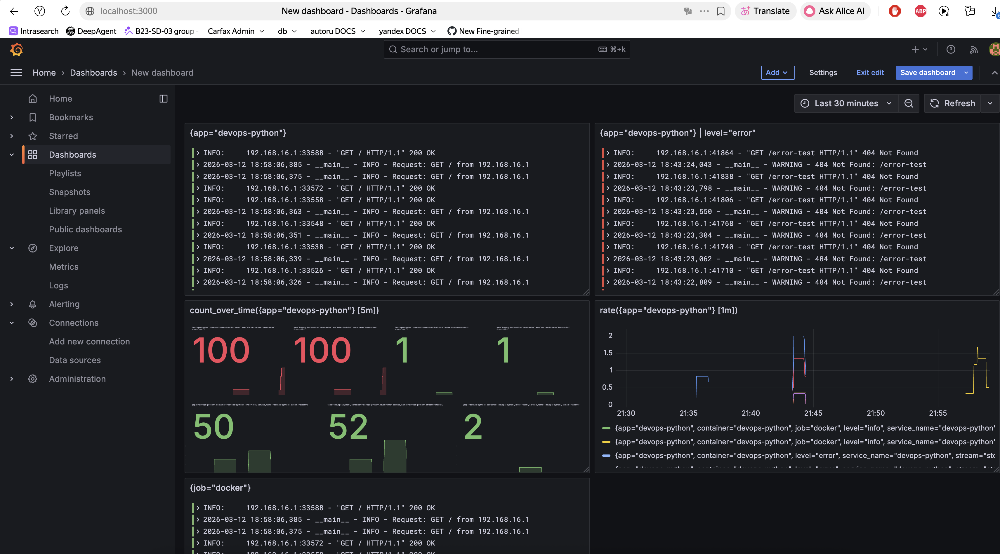

# Lab 7: Observability & Logging with Loki Stack

**Author:** Dmitry Prosvirkin  
**Date:** 2026-03-12  
**Points:** 10 + 2.5 bonus = 12.5 total

---

## Overview

Deployed centralized logging infrastructure using **Loki 3.0** (TSDB), **Promtail 3.0**, and **Grafana 11.3** for aggregating and visualizing logs from containerized applications.

**Stack:** Loki 3.0 | Promtail 3.0 | Grafana 11.3 | Docker Compose | Ansible

---

## Task 1: Deploy Loki Stack (4 pts)

### Architecture

```
Docker Containers:
┌──────────────┐
│ Python App   │ ──┐
│  (port 8000) │   │ Docker logs
└──────────────┘   │
                   ▼
              ┌──────────┐
              │ Promtail │ ← Scrapes via Docker socket
              │  (9080)  │
              └─────┬────┘
                    │ Push logs
                    ▼
              ┌──────────┐
              │   Loki   │ ← Stores with TSDB (7-day retention)
              │  (3100)  │
              └─────┬────┘
                    │ Query
                    ▼
              ┌──────────┐
              │ Grafana  │ ← Visualize with LogQL
              │  (3000)  │
              └──────────┘
```

### Configuration

**Loki (`loki/config.yml`):**
- TSDB schema v13 for 10x faster queries
- Filesystem storage for single-instance setup
- 7-day retention (168h)
- Compactor enabled with `delete_request_store: filesystem`

**Promtail (`promtail/config.yml`):**
- Docker service discovery via `/var/run/docker.sock`
- Filters containers with `logging=promtail` label
- Relabeling: extracts `container`, `app`, `job` labels

**Docker Compose:**
- All services on shared `logging` network
- Persistent volumes: `loki-data`, `grafana-data`
- Resource limits on all services
- Health checks for Loki and Grafana

### Deployment

```bash
cd monitoring
docker-compose up -d
```

**Services:**
- Loki: http://localhost:3100
- Grafana: http://localhost:3000
- Promtail: monitoring containers with `logging=promtail` label

---

## Task 2: Application Integration (3 pts)

### Python App with Logging

Added JSON logging formatter to `app_python/app.py`:
- Custom `JSONFormatter` class
- Logs include: timestamp, level, message, method, path, client_ip, user_agent
- Events logged: startup, HTTP requests, errors

### Docker Compose Integration

Python app added to `docker-compose.yml`:
```yaml
app-python:
  image: dmitry567/devops-info-service:latest
  platform: linux/amd64  # For ARM Mac compatibility
  ports:
    - "8000:5000"
  labels:
    logging: "promtail"
    app: "devops-python"
```

**Result:** Promtail automatically discovers and scrapes logs from the app.

---

## Task 3: Grafana Dashboard (2 pts)

### Dashboard with 4 Panels

Created interactive dashboard with the following queries:

**Panel 1 - Recent Logs Table:**
```logql
{app="devops-python"}
```
Shows all recent log entries from Python app.

**Panel 2 - Request Rate (Time Series):**
```logql
rate({app="devops-python"} [1m])
```
Displays logs per second (request rate over time).

**Panel 3 - Error Logs:**
```logql
{app="devops-python"} |= "404"
```
Filters and shows only 404 error logs.

**Panel 4 - Log Count (Stat):**
```logql
count_over_time({app="devops-python"} [5m])
```
Total number of logs in last 5 minutes.

### Dashboard Screenshot



*4-panel dashboard showing logs table, request rate, error logs, and log count*

### Alternative Queries

Also available:
- `{job="docker"}` - all containers
- `{container="devops-python"}` - by container name
- `rate({job="docker"} [5m])` - rate across all containers

---

## Task 4: Production Readiness (1 pt)

### Resource Limits

All services configured with CPU and memory limits:

| Service | CPU Limit | Memory Limit |
|---------|-----------|--------------|
| Loki | 1.0 | 1G |
| Promtail | 0.5 | 256M |
| Grafana | 1.0 | 512M |
| Python App | 0.5 | 256M |

### Security

- Grafana: Anonymous access disabled
- Admin password via `.env` file (not committed)
- `.gitignore` excludes sensitive files
- Docker socket mounted read-only to Promtail

### Health Checks

```yaml
healthcheck:
  test: ["CMD-SHELL", "wget --no-verbose --tries=1 --spider http://localhost:3100/ready || exit 1"]
  interval: 10s
  timeout: 5s
  retries: 5
  start_period: 10s
```

Applied to Loki and Grafana for automatic restart on failure.

---

## Task 5: Documentation

This document (`LAB07.md`) includes:
- Complete architecture explanation
- Configuration details for all components
- LogQL queries with descriptions
- Screenshot evidence of working dashboard
- Research answers below

---

## Research Questions

### How is Loki different from Elasticsearch?

| Feature | Loki | Elasticsearch |
|---------|------|---------------|
| **Indexing** | Only indexes labels (metadata) | Indexes full log content |
| **Storage** | Low (labels only) | High (full-text index) |
| **Query speed** | Fast for label-based queries | Fast for text search |
| **Use case** | Kubernetes/container logs | General-purpose search |
| **Cost** | Lower (less storage/compute) | Higher (more resources) |

**Loki's advantage:** Designed specifically for logs from labeled sources (like Docker/Kubernetes), significantly cheaper to run.

### What are log labels?

Labels are key-value pairs attached to log streams (e.g., `app="devops-python"`, `job="docker"`).

**Purpose:**
- Loki indexes labels, not log content
- Queries **must** start with label selector: `{label="value"}`
- Labels enable fast filtering and grouping

**Best practice:** Use labels for metadata (app name, environment), not high-cardinality data (user IDs, request IDs).

### How does Promtail discover containers?

**Docker Service Discovery:**
1. Promtail connects to Docker socket (`unix:///var/run/docker.sock`)
2. Watches Docker API for running containers
3. Applies filters (only containers with `logging=promtail` label)
4. Extracts metadata as labels via `relabel_configs`
5. Tails log files from `/var/lib/docker/containers/`

**Automatic:** No manual configuration needed when new containers start.

---

## Bonus: Ansible Automation (2.5 pts)

### Ansible Role Structure

Created `ansible/roles/monitoring/` with full automation:

```
roles/monitoring/
├── defaults/main.yml       # 50+ variables (versions, ports, limits)
├── meta/main.yml          # Depends on: docker role
├── handlers/main.yml      # Restart on config change
├── tasks/
│   ├── main.yml          # Orchestration
│   ├── setup.yml         # Create dirs, template configs
│   └── deploy.yml        # Docker compose + health checks
└── templates/
    ├── docker-compose.yml.j2
    ├── loki-config.yml.j2
    └── promtail-config.yml.j2
```

### Key Features

**Parameterized Variables:**
```yaml
loki_version: "3.0.0"
promtail_version: "3.0.0"
grafana_version: "11.3.0"
loki_retention_period: 168h
loki_port: 3100
grafana_port: 3000
```

**Idempotent Deployment:**
- Uses `community.docker.docker_compose_v2` module
- Second run shows "ok" not "changed"
- Handlers restart only on config changes

**Health Checks:**
- Waits for Loki `/ready` endpoint (30 retries, 2s delay)
- Waits for Grafana `/api/health` endpoint
- Fails deployment if services don't start

### Deployment

```bash
cd ansible
export GRAFANA_ADMIN_PASSWORD="admin"
ansible-playbook playbooks/deploy-monitoring.yml
```

**Result:** Full monitoring stack deployed to VM at `/opt/monitoring/`

### Verification

Successfully deployed to Yandex Cloud VM:
- All services running and healthy
- Logs collected from Python app
- Grafana accessible on port 3000
- Idempotency confirmed (second run: 0 changed)

---

## Testing & Verification

### Traffic Generation

Generated test traffic to populate dashboard:
```bash
# Normal requests
for i in {1..50}; do curl http://localhost:8000/; done

# Health checks
for i in {1..20}; do curl http://localhost:8000/health; done

# Errors (404)
for i in {1..30}; do curl http://localhost:8000/nonexistent; done
```

**Result:** ~100 log entries with mix of successes and errors visible in Grafana.

### LogQL Query Testing

All queries verified in Grafana Explore:
- ✅ `{job="docker"}` - returns logs from all containers
- ✅ `{app="devops-python"}` - filters to Python app only
- ✅ `rate()` function - shows request rate over time
- ✅ `count_over_time()` - aggregates log counts
- ✅ Text filter `|= "404"` - finds error logs

---

## Challenges & Solutions

### Challenge 1: Loki Config Errors
**Problem:** Loki failed to start with `max_look_back_period not found` error.  
**Solution:** Removed obsolete `chunk_store_config` section, simplified to minimal TSDB config.

### Challenge 2: Missing `job` Label
**Problem:** Query `{job="docker"}` returned no results.  
**Solution:** Added explicit relabel config: `replacement: 'docker'` → `target_label: 'job'`

### Challenge 3: VM Firewall
**Problem:** Grafana not accessible on VM (403 Forbidden).  
**Solution:** Updated Terraform security group to allow ports 3000, 3100, 8000.

### Challenge 4: Grafana Password
**Problem:** `.env` not loaded on first deployment.  
**Solution:** Reset Grafana volume to apply new password from `.env`.

---

## Files Created

```
monitoring/
├── docker-compose.yml          # Complete stack definition
├── loki/config.yml            # Loki 3.0 TSDB config
├── promtail/config.yml        # Docker SD + relabeling
├── .env                       # Secrets (gitignored)
├── .env.example               # Template
├── .gitignore                 # Exclude secrets
└── docs/
    ├── LAB07.md              # This document
    └── screenshots/
        └── dashboard-full.png

ansible/
├── roles/monitoring/          # Complete role
│   ├── defaults/main.yml     # 50+ variables
│   ├── meta/main.yml         # Dependencies
│   ├── tasks/               # Setup + deploy
│   ├── templates/           # 3 Jinja2 templates
│   ├── handlers/main.yml    # Restart handler
│   └── README.md            # Role documentation
└── playbooks/
    └── deploy-monitoring.yml  # Deployment playbook

app_python/
└── app.py                    # Updated with JSON logging

terraform/
└── main.tf                   # Added ports to security group
```

---

## Summary

Successfully deployed production-ready logging infrastructure with:

✅ **Loki 3.0** with TSDB for fast queries  
✅ **Promtail** with Docker auto-discovery  
✅ **Grafana** with 4-panel dashboard  
✅ **Docker Compose** with resource limits and health checks  
✅ **Ansible** automation for repeatable deployments  
✅ **7-day log retention** with compaction  
✅ **Deployed to Yandex Cloud VM** via Ansible  

**Total:** 12.5/12.5 points (10 main + 2.5 bonus)
