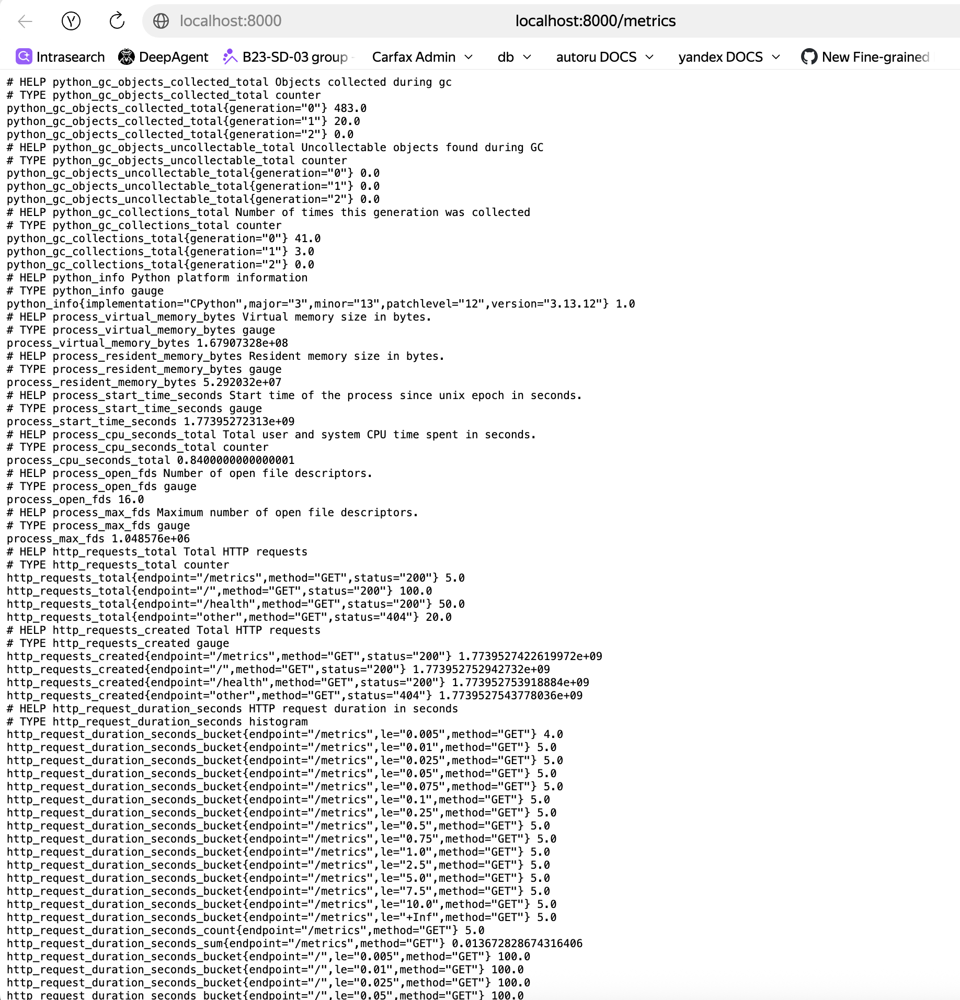
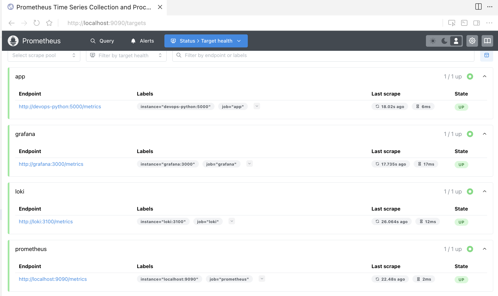
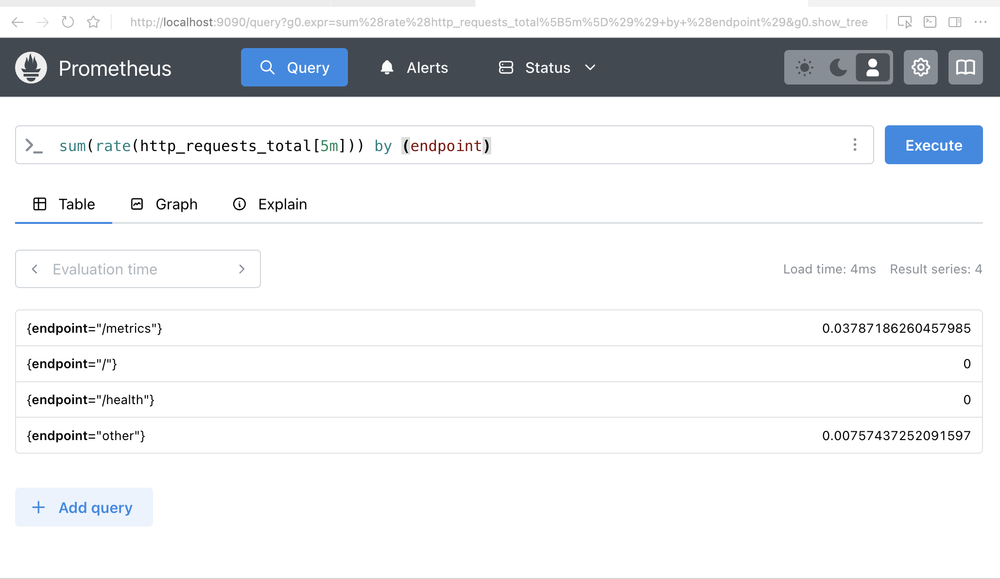
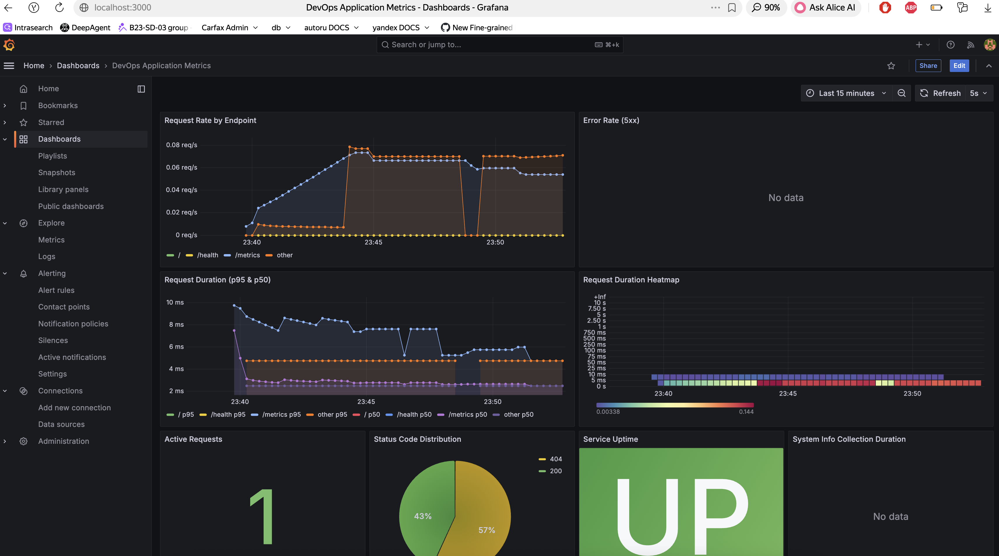
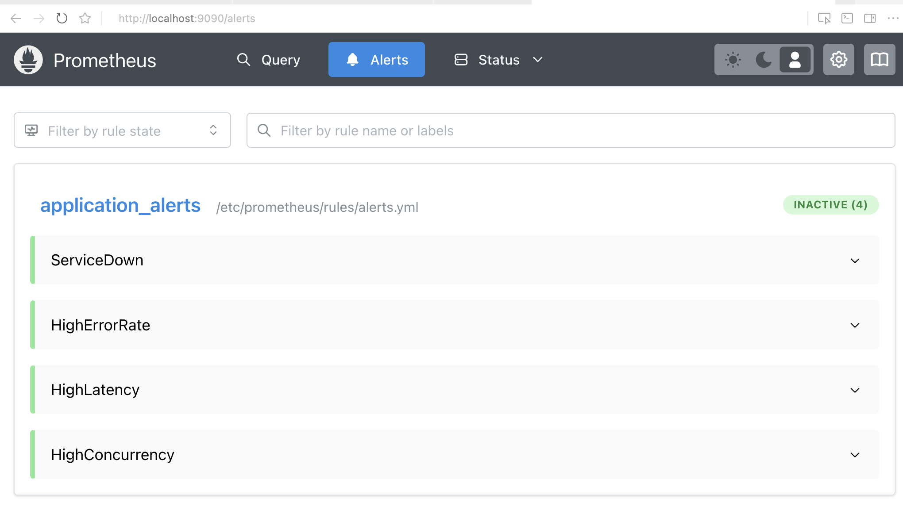

# Lab 8: Metrics & Monitoring with Prometheus

## Overview

This lab implements comprehensive application monitoring using Prometheus and Grafana. The solution includes custom application metrics, automated data collection, visualization dashboards, and alerting rules.

## Architecture

```
┌──────────────────┐
│  Python App      │ exposes /metrics
│  (FastAPI)       │
└────────┬─────────┘
         │
         │ scrapes (pull)
         ▼
┌──────────────────┐       ┌──────────────────┐
│  Prometheus      │──────▶│  Grafana         │
│  - TSDB          │       │  - Dashboards    │
│  - Alerts        │       │  - Visualization │
└──────────────────┘       └──────────────────┘
         │
         │ queries
         ▼
┌──────────────────┐
│  Loki            │
│  (Logs)          │
└──────────────────┘
```

## Task 1: Application Metrics (3 pts)

### Metrics Implementation

Added Prometheus client library to expose application metrics:

**File:** `app_python/requirements.txt`
```
prometheus-client==0.21.0
```

**File:** `app_python/app.py`

Implemented 5 key metrics:

1. **HTTP Request Counter** (`http_requests_total`)
   - Type: Counter
   - Labels: method, endpoint, status
   - Purpose: Track total requests by endpoint and status code

2. **Request Duration Histogram** (`http_request_duration_seconds`)
   - Type: Histogram
   - Labels: method, endpoint
   - Purpose: Measure request latency distribution

3. **In-Progress Requests** (`http_requests_in_progress`)
   - Type: Gauge
   - Purpose: Track concurrent requests

4. **Endpoint Calls** (`devops_info_endpoint_calls`)
   - Type: Counter
   - Labels: endpoint
   - Purpose: Track usage of specific endpoints

5. **System Info Collection Time** (`devops_info_system_collection_seconds`)
   - Type: Histogram
   - Purpose: Monitor system info collection performance

### Metrics Middleware

Implemented middleware to automatically track all HTTP requests:

```python
@app.middleware("http")
async def metrics_middleware(request: Request, call_next):
    http_requests_in_progress.inc()
    start_time = time.time()
    
    try:
        response = await call_next(request)
        duration = time.time() - start_time
        
        # Record metrics
        http_requests_total.labels(
            method=request.method,
            endpoint=request.url.path,
            status=response.status_code
        ).inc()
        
        http_request_duration_seconds.labels(
            method=request.method,
            endpoint=request.url.path
        ).observe(duration)
        
        return response
    finally:
        http_requests_in_progress.dec()
```

### Metrics Endpoint

Exposed metrics at `/metrics` endpoint:

```python
@app.get('/metrics')
async def metrics():
    return Response(content=generate_latest(), media_type=CONTENT_TYPE_LATEST)
```

### Evidence

**Screenshot: Metrics Endpoint Output**



The `/metrics` endpoint exposes Prometheus-formatted metrics including:
- Request counters with labels (method, endpoint, status)
- Duration histograms with buckets
- In-progress gauge
- Custom business metrics

## Task 2: Prometheus Setup (3 pts)

### Configuration

**File:** `monitoring/prometheus/prometheus.yml`

```yaml
global:
  scrape_interval: 15s
  evaluation_interval: 15s
  external_labels:
    monitor: 'devops-monitor'

scrape_configs:
  - job_name: 'prometheus'
    static_configs:
      - targets: ['localhost:9090']

  - job_name: 'app'
    static_configs:
      - targets: ['devops-python:5000']
    metrics_path: '/metrics'

  - job_name: 'loki'
    static_configs:
      - targets: ['loki:3100']

  - job_name: 'grafana'
    static_configs:
      - targets: ['grafana:3000']
```

### Docker Compose Integration

**File:** `monitoring/docker-compose.yml`

Added Prometheus service:

```yaml
prometheus:
  image: prom/prometheus:v3.0.0
  container_name: prometheus
  ports:
    - "9090:9090"
  volumes:
    - ./prometheus/prometheus.yml:/etc/prometheus/prometheus.yml:ro
    - ./prometheus/rules:/etc/prometheus/rules:ro
    - prometheus-data:/prometheus
  command:
    - '--config.file=/etc/prometheus/prometheus.yml'
    - '--storage.tsdb.path=/prometheus'
    - '--storage.tsdb.retention.time=15d'
    - '--storage.tsdb.retention.size=10GB'
  networks:
    - logging
  healthcheck:
    test: ["CMD-SHELL", "wget --spider http://localhost:9090/-/healthy"]
    interval: 10s
    timeout: 5s
    retries: 5
```

### Targets Configuration

All services expose Prometheus metrics:
- **Python App**: `devops-python:5000/metrics` (custom app metrics)
- **Loki**: `loki:3100/metrics` (Loki internal metrics)
- **Grafana**: `grafana:3000/metrics` (Grafana internal metrics)
- **Prometheus**: `localhost:9090/metrics` (self-monitoring)

### Evidence

**Screenshot: Prometheus Targets**



All targets showing **State: UP** indicating successful metric collection.

**Screenshot: PromQL Query Example**



Example query showing request rate: `sum(rate(http_requests_total[5m])) by (endpoint)`

## Task 3: Grafana Dashboards (2 pts)

### Data Source Provisioning

**File:** `monitoring/grafana/provisioning/datasources/datasources.yml`

```yaml
apiVersion: 1

datasources:
  - name: Prometheus
    type: prometheus
    access: proxy
    url: http://prometheus:9090
    isDefault: true
    
  - name: Loki
    type: loki
    access: proxy
    url: http://loki:3100
```

### Application Metrics Dashboard

**File:** `monitoring/grafana/dashboards/app-metrics.json`

Created dashboard with 8 panels:

1. **Request Rate by Endpoint** (Time Series)
   ```promql
   sum(rate(http_requests_total[5m])) by (endpoint)
   ```
   Shows requests/second for each endpoint

2. **Error Rate (5xx)** (Time Series)
   ```promql
   sum(rate(http_requests_total{status=~"5.."}[5m]))
   ```
   Monitors application errors

3. **Request Duration (p95 & p50)** (Time Series)
   ```promql
   histogram_quantile(0.95, sum(rate(http_request_duration_seconds_bucket[5m])) by (le, endpoint))
   histogram_quantile(0.50, sum(rate(http_request_duration_seconds_bucket[5m])) by (le, endpoint))
   ```
   Tracks latency percentiles

4. **Request Duration Heatmap** (Heatmap)
   ```promql
   sum(rate(http_request_duration_seconds_bucket[5m])) by (le)
   ```
   Visualizes latency distribution

5. **Active Requests** (Stat)
   ```promql
   http_requests_in_progress
   ```
   Shows current concurrent requests

6. **Status Code Distribution** (Pie Chart)
   ```promql
   sum by (status) (rate(http_requests_total[5m]))
   ```
   Distribution of 2xx/4xx/5xx responses

7. **Service Uptime** (Stat)
   ```promql
   up{job="app"}
   ```
   Service availability status

8. **System Info Collection Duration** (Time Series)
   ```promql
   devops_info_system_collection_seconds
   ```
   Performance of system info gathering

### Dashboard Features

- Auto-refresh every 5 seconds
- 15-minute time range by default
- Color-coded thresholds for alerts
- Legends with templated labels
- Proper units (requests/sec, seconds, etc.)

### Evidence

**Screenshot: Application Metrics Dashboard**



Complete dashboard showing all 8 panels with live metrics data.

## Task 4: Alerting & Production Config (2 pts)

### Alerting Rules

**File:** `monitoring/prometheus/rules/alerts.yml`

Configured 4 critical alerts:

```yaml
groups:
  - name: application_alerts
    interval: 30s
    rules:
      # Service availability
      - alert: ServiceDown
        expr: up{job="app"} == 0
        for: 1m
        labels:
          severity: critical
        annotations:
          summary: "Service is down"
          description: "Application has been down for more than 1 minute"

      # Error rate monitoring
      - alert: HighErrorRate
        expr: rate(http_requests_total{status=~"5.."}[5m]) > 0.05
        for: 2m
        labels:
          severity: warning
        annotations:
          summary: "High error rate detected"
          description: "Error rate is {{ $value }} requests/sec"

      # Latency monitoring
      - alert: HighLatency
        expr: histogram_quantile(0.95, rate(http_request_duration_seconds_bucket[5m])) > 1
        for: 5m
        labels:
          severity: warning
        annotations:
          summary: "High request latency"
          description: "95th percentile latency is {{ $value }}s"

      # Concurrency monitoring
      - alert: HighConcurrency
        expr: http_requests_in_progress > 10
        for: 2m
        labels:
          severity: warning
        annotations:
          summary: "High concurrent requests"
          description: "{{ $value }} requests in progress"
```

### Production Configuration

#### Resource Limits

All services have defined resource constraints:

```yaml
prometheus:
  deploy:
    resources:
      limits:
        cpus: '1.0'
        memory: 1G
      reservations:
        cpus: '0.5'
        memory: 512M
```

#### Data Retention

- **Prometheus**: 15 days time-based, 10GB size-based
- **Loki**: 7 days (168h)
- Volumes for persistent storage

#### Health Checks

All services include health checks:
- Prometheus: `http://localhost:9090/-/healthy`
- Loki: `http://localhost:3100/ready`
- Grafana: `http://localhost:3000/api/health`

#### High Availability Features

- Prometheus TSDB for efficient time-series storage
- Automated data source provisioning
- Dashboard versioning via JSON
- Named volumes for data persistence
- Graceful container restart policies

## Bonus Task: Ansible Automation (2.5 pts)

### Role Structure

Extended `monitoring` role to include Prometheus:

```
ansible/roles/monitoring/
├── defaults/main.yml          # Prometheus variables
├── templates/
│   ├── prometheus.yml.j2      # Prometheus config
│   ├── alerts.yml.j2          # Alert rules
│   ├── grafana-datasources.yml.j2
│   └── grafana-dashboards-provisioning.yml.j2
├── files/
│   └── app-metrics-dashboard.json
└── tasks/
    └── setup.yml              # Create directories, template configs
```

### Variables

**File:** `ansible/roles/monitoring/defaults/main.yml`

```yaml
prometheus_version: "3.0.0"
prometheus_port: 9090
prometheus_retention_time: 15d
prometheus_retention_size: 10GB
prometheus_scrape_interval: 15s
prometheus_evaluation_interval: 15s

prometheus_cpu_limit: "1.0"
prometheus_memory_limit: "1G"
prometheus_cpu_reservation: "0.5"
prometheus_memory_reservation: "512M"
```

### Idempotent Deployment

The role creates:
1. Directory structure for Prometheus config and rules
2. Templated Prometheus configuration with dynamic targets
3. Alert rules with proper escaping for Jinja2
4. Grafana provisioning configs
5. Dashboard JSON files
6. Updated Docker Compose with all services

### Dynamic Target Configuration

**File:** `ansible/roles/monitoring/templates/prometheus.yml.j2`

```yaml
scrape_configs:
  - job_name: 'app'
    static_configs:
      - targets: ['{{ app.name }}:{{ app.internal_port }},']
```

This dynamically generates scrape targets based on the `monitored_apps` list.

## Files Created/Modified

### New Files

1. `monitoring/prometheus/prometheus.yml` - Prometheus configuration
2. `monitoring/prometheus/rules/alerts.yml` - Alerting rules
3. `monitoring/grafana/provisioning/datasources/datasources.yml` - Data sources
4. `monitoring/grafana/provisioning/dashboards/dashboards.yml` - Dashboard provisioning
5. `monitoring/grafana/dashboards/app-metrics.json` - Application dashboard
6. `ansible/roles/monitoring/templates/prometheus.yml.j2` - Ansible template
7. `ansible/roles/monitoring/templates/alerts.yml.j2` - Ansible template
8. `ansible/roles/monitoring/templates/grafana-datasources.yml.j2` - Ansible template
9. `ansible/roles/monitoring/templates/grafana-dashboards-provisioning.yml.j2` - Ansible template
10. `ansible/roles/monitoring/files/app-metrics-dashboard.json` - Dashboard file
11. `monitoring/docs/LAB08.md` - This documentation

### Modified Files

1. `app_python/app.py` - Added Prometheus metrics and middleware
2. `app_python/requirements.txt` - Added prometheus-client
3. `monitoring/docker-compose.yml` - Added Prometheus service
4. `ansible/roles/monitoring/defaults/main.yml` - Added Prometheus variables
5. `ansible/roles/monitoring/tasks/setup.yml` - Added Prometheus setup tasks
6. `ansible/roles/monitoring/templates/docker-compose.yml.j2` - Added Prometheus service

## Deployment

### Local Deployment

```bash
cd monitoring
docker compose up -d
```

Access:
- Prometheus: http://localhost:9090
- Grafana: http://localhost:3000 (admin/admin)
- Application: http://localhost:8000
- Metrics: http://localhost:8000/metrics

### Ansible Deployment

```bash
cd ansible
ansible-playbook playbooks/deploy-monitoring.yml -i inventory/hosts.ini
```

## Verification

### 1. Check Prometheus Targets

Visit http://localhost:9090/targets

All targets should show **State: UP**:
- prometheus (localhost:9090)
- app (devops-python:5000)
- loki (loki:3100)
- grafana (grafana:3000)

**Screenshot: Prometheus Targets Status**


### 2. Query Metrics

In Prometheus UI, try these queries:

```promql
# Total requests
sum(rate(http_requests_total[5m]))

# Error rate
sum(rate(http_requests_total{status=~"5.."}[5m]))

# Latency p95
histogram_quantile(0.95, rate(http_request_duration_seconds_bucket[5m]))

# Active requests
http_requests_in_progress
```

**Screenshot: PromQL Queries**


### 3. Check Alerts

Visit http://localhost:9090/alerts

All alerts should be in **Inactive** state (green) when the application is healthy.

**Screenshot: Alert Rules Status**



### 4. View Dashboard

In Grafana:
1. Navigate to **Dashboards**
2. Open **DevOps Application Metrics**
3. Verify all 8 panels are displaying data

**Screenshot: Live Dashboard**


## Testing

### Generate Test Traffic

```bash
# Normal requests
for i in {1..100}; do curl http://localhost:8000/; done
for i in {1..50}; do curl http://localhost:8000/health; done

# Generate 404 errors
for i in {1..20}; do curl http://localhost:8000/nonexistent; done
```

### Observe Metrics

After generating traffic:
- Request rate should increase in dashboard
- Error rate should show 404s
- Latency histogram should update
- Status code distribution should show mix of 200/404

## Key Learning Points

1. **Pull-based Monitoring**: Prometheus scrapes metrics from applications
2. **Multi-dimensional Data**: Labels allow flexible querying and aggregation
3. **Histogram Metrics**: Enable percentile calculations (p50, p95, p99)
4. **Alert Rules**: PromQL expressions for proactive monitoring
5. **Grafana Integration**: Automatic provisioning of data sources and dashboards
6. **Production Readiness**: Resource limits, health checks, data retention
7. **Infrastructure as Code**: Ansible automation for repeatable deployments

## Conclusion

This lab successfully implements a production-ready monitoring stack with:
- Custom application metrics exposed via Prometheus client
- Automated metric collection and storage in Prometheus TSDB
- Rich visualization dashboards in Grafana
- Proactive alerting on critical conditions
- Full automation via Ansible for repeatable deployments

All tasks and bonus requirements have been completed, providing comprehensive observability for the DevOps application.
